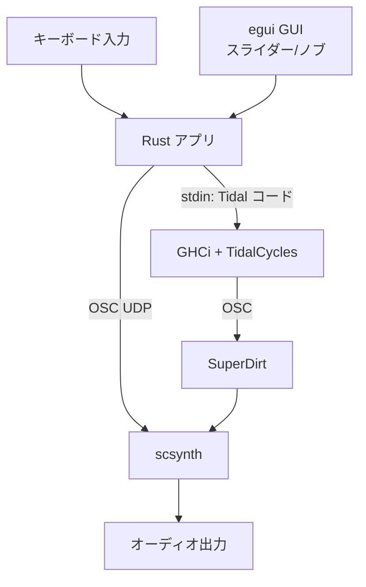
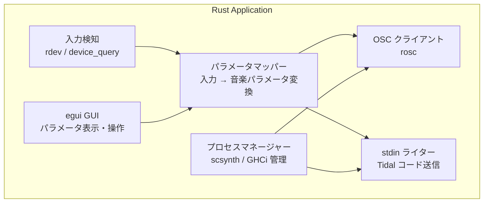

---
tags:
  - decision
  - architecture
  - osc
  - process-management
---
# アーキテクチャ設計

depends-on:
- [技術スタック選定](./2026-04-05-dec-tech-stack.md)

## プロセス構成

本アプリケーションは3つのプロセスで構成される。

| プロセス | 起動方法 | 役割 |
|---------|---------|------|
| Rust アプリ（メイン） | ユーザーが起動 | 全体制御・GUI・入力検知 |
| scsynth + sclang | Rust から起動 | 音声合成サーバー + SuperDirt |
| GHCi + TidalCycles | Rust から起動 | パターンエンジン |

## データフロー



## 通信方式

### Rust → TidalCycles（stdin パイプ）

Rust が `ghci` プロセスを起動し、BootTidal.hs をロードした状態で stdin にコマンドを流し込む。

```
-- BPM変更
setcps 0.5

-- パターン変更
d1 $ sound "bd sn:2 cp sn"

-- パターン変形
d1 $ fast 2 $ sound "bd sn"

-- 停止
d1 $ silence
```

エディタプラグイン（VS Code, Vim）と同じ仕組み（[vim-tidal 実装](https://github.com/tidalcycles/vim-tidal)）。

### Rust → scsynth（OSC / UDP）

`rosc` クレートで OSC メッセージを scsynth（デフォルト: `127.0.0.1:57110`）に送信する（[SC Server Command Reference](https://doc.sccode.org/Reference/Server-Command-Reference.html)）。

用途: Tidal を経由しない直接的な音色パラメータ操作（フィルタ、エフェクト等）。

```
/n_set <nodeID> <param> <value>   -- ノードのパラメータ変更
/s_new <synthdef> <nodeID> ...    -- シンセ生成
```

### Tidal → SuperDirt → scsynth（OSC / 自動）

TidalCycles が生成したパターンイベントは OSC で SuperDirt に送信され、SuperDirt が scsynth のシンセを制御する。この通信は Tidal/SuperDirt の内部動作であり、Rust 側での管理は不要（[SuperDirt Protocol](https://github.com/musikinformatik/SuperDirt)）。

## Rust アプリの内部構成



### モジュール責務

| モジュール | 責務 |
|-----------|------|
| `input` | グローバルキーボードイベントのキャプチャ |
| `mapper` | 入力イベントを音楽パラメータ（BPM、音色、パターン変形）に変換 |
| `osc` | OSC メッセージの構築・送信 |
| `process` | scsynth / sclang / GHCi プロセスの起動・監視・再起動 |
| `tidal` | Tidal コードの生成・stdin への送信 |
| `gui` | egui ベースのパラメータ表示・操作UI |

## キーボード入力 → 音楽パラメータの変換（初期設計）

初期段階では単純なマッピングから始める:

| 入力 | パラメータ | 変換例 |
|------|-----------|--------|
| タイピング速度（WPM） | BPM | WPM × 2 → BPM（未検証） |
| 特定キー（修飾キー等） | パターン切り替え | Ctrl → パターンA, Alt → パターンB |
| 入力頻度の変動 | 音色の明るさ | 頻度高 → ブライト、頻度低 → ダーク |

マッピングルールは設定ファイル（TOML）で外部化し、再起動なしで変更可能にする（未検証）。

## エラーハンドリング

- scsynth / GHCi プロセスが異常終了した場合、自動再起動を試みる
- OSC 送信失敗時はリトライ（UDP のため基本的にはロスを許容）
- GUI にプロセス状態（起動中/実行中/エラー）を表示する
