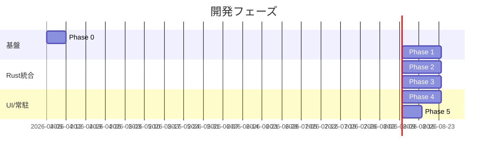

---
tags:
  - decision
  - roadmap
  - development-phases
---
# 開発ロードマップ

depends-on:
- [プロジェクト概要](./2026-04-05-dec-project-overview.md)
- [アーキテクチャ設計](./2026-04-05-dec-architecture.md)
- [技術スタック選定](./2026-04-05-dec-tech-stack.md)

## フェーズ概要

## Phase 0: 環境構築

### ゴール
SC, TidalCycles, Rust の開発環境が整い、それぞれ単体で動作確認できる状態。

### タスク
- [ ] SuperCollider インストール・動作確認（音が鳴る）
- [ ] SuperDirt インストール（`Quarks.install("SuperDirt")`）（[SuperDirt インストール手順](https://github.com/musikinformatik/SuperDirt)）
- [ ] GHCup で Haskell ツールチェイン（GHC, cabal）インストール（[GHCup](https://www.haskell.org/ghcup/)）
- [ ] TidalCycles インストール（`cabal install tidal`）（[Tidal インストール手順](https://tidalcycles.org/docs/getting-started/installation)）
- [ ] Tidal から SuperDirt 経由で音が鳴ることを確認
- [ ] Rust ツールチェインの確認（rustup, cargo）
- [ ] `cargo init` で Rust プロジェクト作成

### 確認方法
- SC: `{ SinOsc.ar(440, 0, 0.5) }.play` で正弦波が鳴る
- Tidal: `d1 $ sound "bd sn"` でドラムが鳴る

## Phase 1: SC + Tidal で音を鳴らす基盤構築

### ゴール
Tidal のパターン記述と SC のシンセサイザーで、リアクティブ BGM の素材となる音が作れる状態。

### タスク
- [ ] SuperDirt で使えるサンプル・シンセの把握
- [ ] 基本的な Tidal パターンの習得（`sound`, `note`, `fast`, `slow`, `every`）
- [ ] BPM（`setcps`）やパターン変形のリアルタイム変更を手動で試す
- [ ] BGM として使えるパターンのプロトタイプを2-3個作成
- [ ] SC のカスタム SynthDef を1つ作成し、SuperDirt から呼び出す（未検証）

### 確認方法
- 複数のパターンを切り替えながら BGM として成立する音が出せる

## Phase 2: Rust から SC/Tidal を制御

### ゴール
Rust アプリから SC と Tidal をプログラマティックに制御できる状態。

### タスク
- [ ] `rosc` クレートで scsynth に OSC メッセージを送信（[rosc crates.io](https://crates.io/crates/rosc)）
- [ ] Rust から sclang プロセスを起動し SuperDirt をブート
- [ ] Rust から GHCi + Tidal プロセスを起動（BootTidal.hs のロード）
- [ ] stdin 経由で Tidal コード（`d1 $ sound "bd sn"` 等）を送信
- [ ] プロセスの起動・終了・エラーハンドリング
- [ ] `setcps` による BPM 変更が Rust から実行できることを確認

### 確認方法
- Rust の `cargo run` だけで SC + Tidal が起動し、音が鳴り、パラメータ変更できる

## Phase 3: キーボード入力連動

### ゴール
キーボード入力に応じて BGM がリアルタイムに変化する。

### タスク
- [ ] `rdev` または `device_query` クレートでグローバルキーボードイベント取得（未検証）
- [ ] タイピング速度（WPM）の計算ロジック
- [ ] WPM → BPM のマッピング実装
- [ ] 特定キー → パターン切り替えの実装
- [ ] マッピングルールの設定ファイル化（TOML）

### 確認方法
- アプリ起動後、他のアプリで文字を打つと BGM の BPM が変化する

## Phase 4: egui ミニマル UI

### ゴール
現在のパラメータ状態を確認し、手動で調整できる GUI。

### タスク
- [ ] eframe でウィンドウ作成
- [ ] 現在の BPM、アクティブパターン、音色パラメータの表示
- [ ] スライダーで BPM / 音色パラメータを手動調整
- [ ] プロセス状態（SC / Tidal の起動状態）の表示
- [ ] キーボード連動の ON/OFF トグル

### 確認方法
- GUI のスライダー操作で即座に BGM が変化する

## Phase 5: システムトレイ常駐化

### ゴール
システムトレイに常駐し、必要に応じて GUI を開閉できる。

### タスク
- [ ] `tray-item` 等のクレートでシステムトレイアイコン表示（未検証）
- [ ] トレイアイコンのコンテキストメニュー（開く / 一時停止 / 終了）
- [ ] ウィンドウを閉じてもバックグラウンドで動作継続
- [ ] OS 起動時の自動起動設定（オプション）

### 確認方法
- ウィンドウを閉じても BGM が継続し、トレイアイコンから再表示できる
