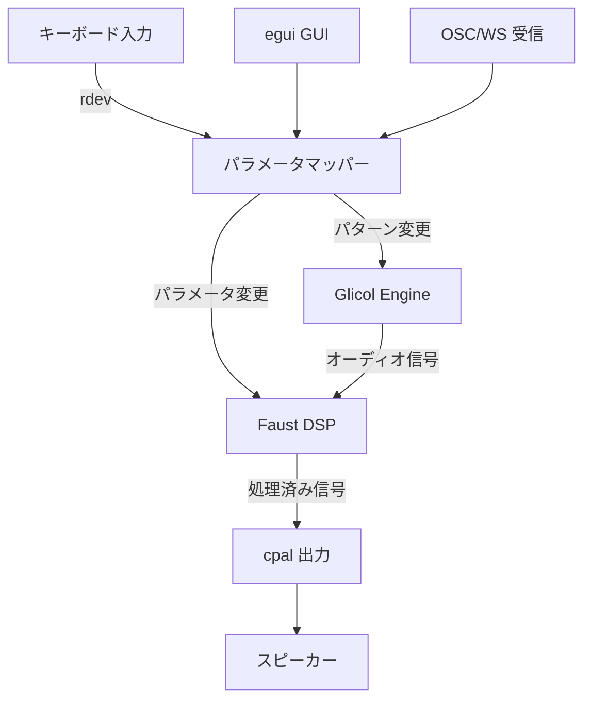

---
tags:
  - decision
  - architecture
  - glicol
  - faust
---
# アーキテクチャ設計 v2

depends-on:
- [技術スタック選定 v2](./2026-04-07-dec-tech-stack-v2.md)

## 設計原則

**音声エンジンとインターフェースの完全分離。** コアエンジンを独立したライブラリとして構築し、デスクトップアプリ・サーバー・Unity プラグイン等の任意のフロントエンドから利用可能にする。

## クレート構成

```
reactive-bgm/
├── Cargo.toml              (workspace)
├── engine/                  (reactive-bgm-engine)
│   ├── Cargo.toml           (lib + cdylib)
│   ├── build.rs             (Faust → Rust コンパイル)
│   ├── dsp/                 (Faust .dsp ファイル)
│   └── src/
│       ├── lib.rs           (公開 API)
│       ├── ffi.rs           (C ABI)
│       ├── glicol.rs        (Glicol エンジンラッパー)
│       ├── faust.rs         (Faust DSP ラッパー)
│       └── audio.rs         (cpal オーディオ出力)
├── server/                  (reactive-bgm-server)
│   ├── Cargo.toml           (bin)
│   └── src/
│       └── main.rs          (OSC/WebSocket サーバー)
├── app/                     (reactive-bgm-app)
│   ├── Cargo.toml           (bin)
│   └── src/
│       ├── main.rs          (エントリポイント)
│       ├── input.rs         (キーボードキャプチャ)
│       ├── mapper.rs        (入力→パラメータ変換)
│       └── gui.rs           (egui UI)
├── docs/
└── scripts/
```

## データフロー



## コアエンジン API

### Rust API (lib)

```rust
pub struct Engine { /* ... */ }

impl Engine {
    /// エンジンを初期化しオーディオ出力を開始
    pub fn new(config: EngineConfig) -> Result<Self>;

    /// Glicol パターンコードを更新（差分適用）
    pub fn update_pattern(&mut self, code: &str) -> Result<()>;

    /// Faust DSP パラメータを変更
    pub fn set_param(&mut self, name: &str, value: f32) -> Result<()>;

    /// 現在のパラメータ値を取得
    pub fn get_param(&self, name: &str) -> Option<f32>;

    /// オーディオ出力を一時停止/再開
    pub fn pause(&mut self);
    pub fn resume(&mut self);
}
```

### C ABI (cdylib)

```c
// Unity 等から P/Invoke で呼び出し可能
void* rbgm_engine_new(const char* config_json);
int   rbgm_engine_update_pattern(void* engine, const char* code);
int   rbgm_engine_set_param(void* engine, const char* name, float value);
float rbgm_engine_get_param(void* engine, const char* name);
void  rbgm_engine_pause(void* engine);
void  rbgm_engine_resume(void* engine);
void  rbgm_engine_free(void* engine);
```

## インタラクティブ制御

### パターンの動的変更

Glicol の `Engine::update_with_code()` を使い、パターンコード全体を差し替え。差分検出で変更部分のみ更新されるため、音が途切れない（未検証）。

```rust
// キーボード入力に応じてパターンを生成
let code = match typing_speed {
    0..=30  => "~seq: seq 60 0 0 0 >> sawsynth 0.01 0.1",
    31..=60 => "~seq: seq 60 67 0 72 >> sawsynth 0.01 0.1",
    _       => "~seq: seq 60 63 67 72 >> sawsynth 0.005 0.05",
};
engine.update_pattern(code)?;
```

### 音色のリアルタイム変更

Faust DSP の `hslider` パラメータを外部から変更:

```faust
// synth.dsp
process = osc(freq) * env
with {
    freq = hslider("freq", 440, 20, 20000, 1);
    env  = hslider("volume", 0.5, 0, 1, 0.01);
};
```

```rust
engine.set_param("freq", 880.0)?;
engine.set_param("volume", 0.3)?;
```

## OSC/WebSocket サーバー

コアエンジンを OSC / WebSocket でラップし、外部アプリから制御可能にする。

### OSC メッセージ例

```
/pattern <string>        -- パターンコード更新
/param <name> <float>    -- パラメータ変更
/pause                   -- 一時停止
/resume                  -- 再開
```

### WebSocket

JSON メッセージで同等の操作を提供。Web フロントエンドやゲームエンジンからの利用を想定。

```json
{"type": "pattern", "code": "~seq: seq 60 67 72 >> sawsynth 0.01 0.1"}
{"type": "param", "name": "freq", "value": 880.0}
```
