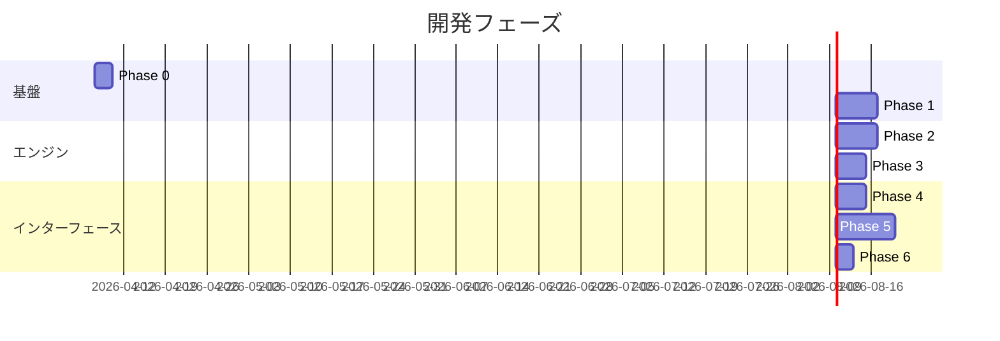

---
tags:
  - decision
  - roadmap
  - development-phases
---
# 開発ロードマップ v2

depends-on:
- [アーキテクチャ設計 v2](./2026-04-07-dec-architecture-v2.md)
- [技術スタック選定 v2](./2026-04-07-dec-tech-stack-v2.md)

## フェーズ概要

## Phase 0: 環境構築

### ゴール
Cargo workspace と Faust コンパイラが動作し、ビルドパイプラインが通る状態。

### タスク
- [ ] Faust コンパイラインストール（`faust` コマンド）
- [ ] Cargo workspace 作成（engine / server / app）
- [ ] `faust-build` クレートの動作確認（build.rs で .dsp → .rs 変換）
- [ ] `glicol` クレートの依存追加と基本動作確認

### 確認方法
- `cargo build` が通る

## Phase 1: Faust シンセで音を鳴らす

### ゴール
Faust で定義したシンセサイザーが cpal 経由で音を出力する。

### タスク
- [ ] 基本シンセの Faust DSP 定義（`engine/dsp/synth.dsp`）
- [ ] build.rs で Faust → Rust コンパイル
- [ ] cpal でオーディオストリーム作成
- [ ] Faust DSP をオーディオコールバック内で実行
- [ ] `hslider` パラメータの外部制御確認

### 確認方法
- `cargo run -p reactive-bgm-engine --example synth` で音が鳴る
- パラメータ変更で音色が変わる

## Phase 2: Glicol エンジン統合

### ゴール
Glicol でパターン/シーケンスを記述し、Faust DSP と接続して音が鳴る。

### タスク
- [ ] Glicol Engine の初期化と基本パターン再生
- [ ] `Engine::update_with_code()` でパターン動的変更
- [ ] Glicol のオーディオ出力と Faust DSP の接続方法を検証
- [ ] Engine 公開 API 実装（`update_pattern`, `set_param`）

### 確認方法
- パターンコードを変更すると音のシーケンスが変わる

## Phase 3: C ABI 公開

### ゴール
エンジンを cdylib としてビルドし、C ABI 経由で外部から呼べる。

### タスク
- [ ] `ffi.rs` に C ABI 関数を実装
- [ ] `Cargo.toml` に `crate-type = ["lib", "cdylib"]` 設定
- [ ] C ヘッダー自動生成（`cbindgen`）
- [ ] 簡単な C テストプログラムから呼び出し確認

### 確認方法
- `.dll` / `.so` / `.dylib` が生成される
- C プログラムから関数呼び出しで音が鳴る

## Phase 4: OSC/WebSocket サーバー

### ゴール
コアエンジンを OSC / WebSocket でラップし、外部アプリから制御可能にする。

### タスク
- [ ] `rosc` で OSC サーバー実装（UDP 受信）
- [ ] `tungstenite` で WebSocket サーバー実装
- [ ] OSC メッセージ → エンジン API のマッピング
- [ ] 外部 OSC クライアントからの制御確認

### 確認方法
- `cargo run -p reactive-bgm-server` でサーバー起動
- OSC クライアント（SC, TouchOSC 等）からパターン変更・パラメータ変更ができる

## Phase 5: キーボード入力 + egui GUI

### ゴール
キーボード入力に応じて BGM が変化し、GUI でパラメータを確認・調整できる。

### タスク
- [ ] `rdev` でグローバルキーボードイベント取得
- [ ] タイピング速度（WPM）計算
- [ ] WPM → BPM / パターン変更のマッピング
- [ ] egui でパラメータ表示・スライダー操作
- [ ] マッピングルールの設定ファイル化（TOML）

### 確認方法
- `cargo run -p reactive-bgm-app` でアプリ起動
- キーボード入力で BGM が変化する
- GUI スライダーでパラメータ調整ができる

## Phase 6: システムトレイ常駐化

### ゴール
システムトレイに常駐し、バックグラウンドで BGM を再生し続ける。

### タスク
- [ ] システムトレイアイコン表示
- [ ] コンテキストメニュー（開く / 一時停止 / 終了）
- [ ] ウィンドウを閉じてもバックグラウンド動作継続

### 確認方法
- ウィンドウを閉じても BGM が継続し、トレイアイコンから再表示できる
