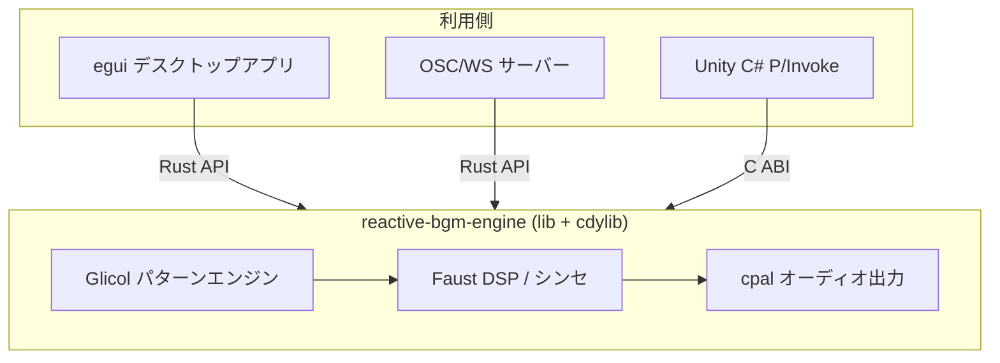

---
tags:
  - research
  - consideration
  - decision
  - tech-stack
  - glicol
  - faust
  - rust
---
# 技術スタック選定 v2

depends-on:
- [技術スタック選定 v1](./2026-04-05-dec-tech-stack.md)

## 背景

v1（Rust + SuperCollider + TidalCycles）は動作確認まで完了したが、以下の課題があった:

1. 3プロセス・3言語・2種類IPC（stdin + OSC）で複雑
2. SC/Tidal をユーザーに個別インストールさせる必要があり配布困難
3. WSL2 ではキーボードキャプチャ・オーディオ出力不可。Windows ネイティブ必須
4. 音声エンジンが SC/Tidal に密結合で、Unity 等の外部インターフェースから利用困難

## 決定: Rust + Glicol + Faust

### 構成

| レイヤー | 技術 | 役割 |
|---------|------|------|
| DSP/シンセ | Faust → Rust (faust-build) | ビルド時に Rust コード生成。高品質シンセ・エフェクト |
| シーケンシング | Glicol (Rust) | ライブコーディングエンジン。動的パターン制御 |
| オーディオ出力 | cpal | クロスプラットフォーム音声出力 |
| キーボード | rdev | グローバルキーボードキャプチャ |
| GUI | egui (eframe) | パラメータ表示・操作 |
| サーバー通信 | rosc + tungstenite | OSC / WebSocket |

### アーキテクチャ

音声エンジンとインターフェースを完全分離する3クレート構成:

- `reactive-bgm-engine` (lib + cdylib): コアエンジン
- `reactive-bgm-server` (bin): OSC/WebSocket サーバー（エンジンのラッパー）
- `reactive-bgm-app` (bin): egui デスクトップアプリ

## 選定理由

### Glicol

- Rust ネイティブのライブコーディングエンジン（[Glicol GitHub, 2.9k stars, MIT](https://github.com/chaosprint/glicol)）
- `Engine::update_with_code()` でリアルタイムにパターンを差し替え可能
- 差分検出で変更部分のみ更新される
- `glicol_synth` の `send_msg()` でノード単位の低レベル制御も可能
- **リスク**: pre-1.0 で API 変更の可能性あり

### Faust

- 関数型 DSP プログラミング言語。25年以上の学術・商用実績（[Faust 公式](https://faust.grame.fr/)）
- `-lang rust` で Rust コード生成をネイティブサポート
- `faust-build` クレートで build.rs に統合可能（[rust-faust GitHub](https://github.com/Frando/rust-faust)）（未検証）
- `hslider` / `vslider` でパラメータを定義し、実行時に外部から値を変更可能
- **ライセンス**: コンパイラは LGPL だが、**生成コードには LGPL が適用されない**（[Faust FAQ](https://faust.grame.fr/community/faq/)）。商用利用可

### cpal

- Rust のクロスプラットフォームオーディオ出力ライブラリ（[cpal GitHub](https://github.com/RustAudio/cpal), Apache-2.0）
- Windows (WASAPI), macOS (CoreAudio), Linux (ALSA/PulseAudio) 対応
- Glicol が内部で使用

### 配布

- 1バイナリで完結。SC/GHCi/Tidal の個別インストール不要
- C ABI (cdylib) で Unity 等の外部エンジンからも利用可能

## 検討した代替案

### v1: Rust + SuperCollider + TidalCycles

- パターン表現力は最強（Tidal）+ DSP 品質最強（SC）
- 配布困難、WSL ネットワーク問題、3プロセス構成の複雑さ
- SC は GPL-3.0 でバンドル時にアプリ全体に伝播
- **不採用理由**: 配布困難、アーキテクチャの複雑さ

### Tauri + Strudel (TidalCycles JS移植)

- Tidal のパターン言語がそのまま使える。配布も容易（Tauri インストーラー）
- **不採用理由**: WebView 内に音声エンジンが閉じるため、Unity 等の外部インターフェースから利用困難

### Pure Rust (fundsp + 自前シーケンサー)

- 1バイナリ・依存ゼロで配布最強
- **不採用理由**: パターン/シーケンス機能を全て自作する必要あり。Glicol があればその必要なし

### scsynth バンドル

- SC のシンセエンジンだけをバンドル
- **不採用理由**: GPL-3.0 がアプリ全体に伝播

### Csound (csound-rs)

- 音声合成言語として成熟。LGPL-2.1
- **不採用理由**: Rust バインディング (csound-rs) が 2020年から停滞。Csound 7 未対応

### libpd-rs (Pure Data 組み込み)

- アーキテクチャは最もシンプル（1プロセス）
- **不採用理由**: ビジュアルプログラミング前提。libpd-rs の docs.rs ビルド失敗

### FMOD

- ゲーム音楽ミドルウェアの標準
- **不採用理由**: サンプル再生ベース。リアルタイム音声合成に不向き

## Glicol パターン表現力の補完戦略

Glicol のパターン操作は TidalCycles より弱い。以下で段階的に補完:

1. **Phase 1**: Glicol コードで複数パターンプリセットを事前定義し、切り替える
2. **Phase 2**: Rust 側でパターン変形ロジック（fast, rev, every 相当）を実装し、Glicol コードを動的生成
3. **Phase 3**: 将来的にパターン DSL を自前実装する余地を残す
